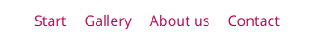
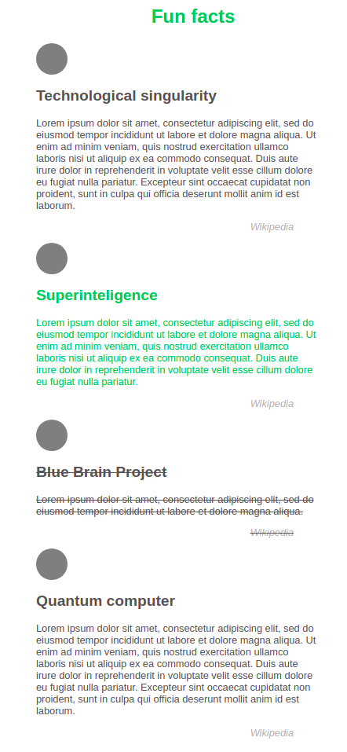
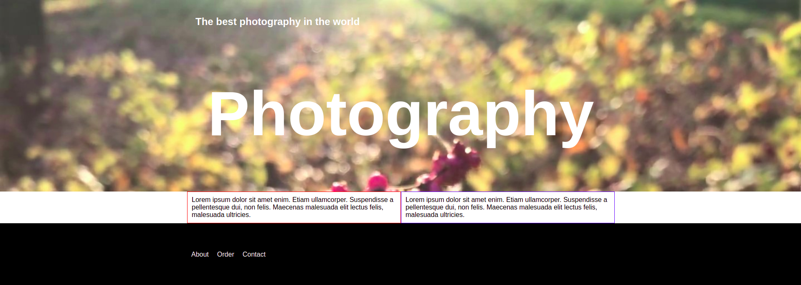
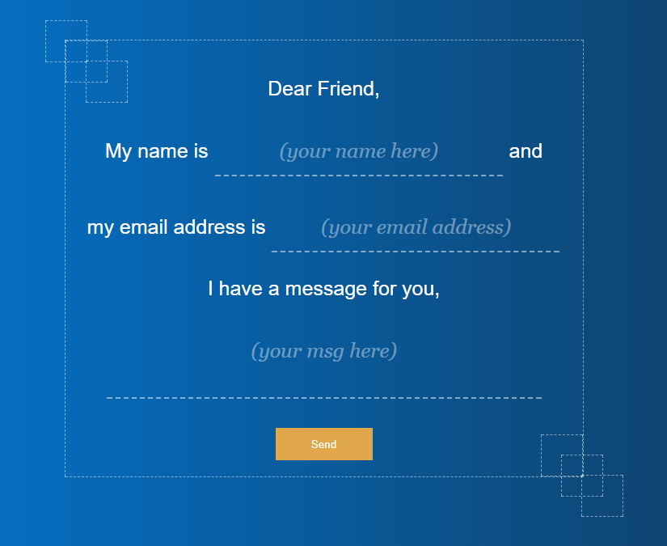

# Advanced HTML and CSS &ndash; exam

## Guidelines for github

1. [*Fork*](https://guides.github.com/activities/forking/) the repository containing exercises.
2. Clone the repository onto your computer using the command: `git clone repository_address`.
You will find the address of the repository by pressing "Clone or download" button on its webpage.
3. Complete the exercises and commit changes to your repository using the commands below.
`git add filename` will add a single file which you have changed.
If you want to add all the changed files at once, use `git add .`.
Remember that the fullstop (dot) at the end of this command is important!
Next, commit changes using `git commit -m "description_of_changes"`.
4. Push changes to your repository on GitHub by typing: `git push origin master`.
5. Create a [*pull request*](https://help.github.com/articles/creating-a-pull-request) to the original repository when you have finished all the exercises.

## Notes on completing the tasks

These tasks are tested using **special automatic tests**. Therefore, be sure to:
* indent the code,
* never use Polish characters - try to use English,
* always check if your solution works. If it throws errors, it will not be evaluated - in such case, better comment **sensitive** parts.

---------------------------------------------------------------------

## Exercise 1

(2 pts)

Solving this task, enter the HTML code in the ```exercise01.html```  file, and the CSS code in the ```css/exercise01.css``` file.

Your task is to create a menu, according to the guidelines below:


**Guidelines:**
*  Menu elements must be next to each other;
*  Menu elements must be clickable;
*  Menu elements should not be underlined;
*  Menu elements should have the color:  #B01E57;
*  The font for all elements on the page should be set to: "Open Sans", (use https://fonts.google.com/);
*  Remember to use the right elements to create the menu.

Finished menu should look the following way:



## Exercise 2

(5 pts)

Doing this task, **do not change** anything in the ```exercise02.html``` file.
Write your code **only** in the ```css/exercise02.css``` file.

Open the ```exercise02.html``` file in your browser and inspect the page it contains. You will find there several articles.

* in the second article, set the font color for the header and the text to: #1db954,
* in the third article, set a strikethrough for the header, text and source,
* place an element in the form of a circle over each article. The circle should have the following properties:
    * width and height: 50px
    * background color: grey

**Guidelines:**
- Do not change the HTML code
- Do not use !important

This is what the website should look like after you have made the changes.



## Exercise 3

(10 pts)

Solving this task, you can modify the HTML code in the ```exercise03.html``` file, adding classes to appropriate elements.
Place the CSS code in the file `` `css / exercise03.css```

Your task is to create a minimalistic page template in accordance with the following guidelines.
Also look at the image below, it will make understanding the commands easier. Try to imitate this template according to the guidelines:

* Create a ```center``` class that will center the page. Style it in CSS so that it centers a ```1024px``` wide page. Add the ```center``` class to appropriate HTML tags. Think carefully which tags to choose;
* Set the font on the whole page to Arial and reset the basic styles;
* Load the image named ```exercise03.jpg``` into the element with the ```id``` ```mainBackground```;
* Place the text "Photography" in the center of the container that it is located in (center only horizontally). Set it to white, font size: 150px;
* Under the ```header```, there is a section containing two articles. Align them side by side;
* Style the footer so that it has black background, is stretched to 100% of the browser's width, and the the list that is inside it, is adjacent to the **left edge** of the page center (see the picture below for reference).

Try to reproduce the page as best as possible.

This is what the website should look like after you have made the changes.



## Exercise 4

(3 pts)

Doing this task, **do not change** anything in the ```exercise04.html``` file.
Write your code **only** in the ```css/exercise04.css``` file.

Your task is to place six squares.
Take a look at the picture below, it will make it easier for you to understand how to set them. Guidelines that will help you a little:

* Width and height of each square is 50px;
* Border is the same as in the form, i.e.: 1px dashed rgba(255, 255, 255, 0.5);


